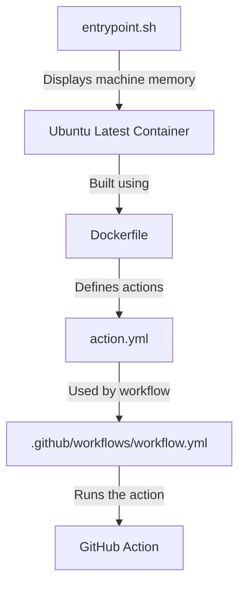

# Course Github Container Action

diagram

```mermaid
flowchart  TD
    A[entrypoint.sh] -->|Displays machine memory| B[Ubuntu Latest Container]
    B -->|Built using| C[Dockerfile]
    C -->|Defines actions| D[action.yml]
    D -->|Used by workflow| E[.github/workflows/workflow.yml]
    E -->|Runs the action| F[GitHub Action]

```